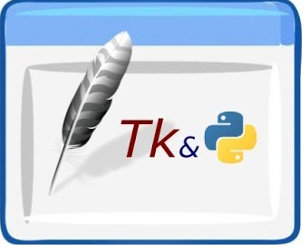

<!--
*** Thanks for checking out this README Template. If you have a suggestion that would
*** make this better, please fork the repo and create a pull request or simply open
*** an issue with the tag "enhancement".
*** Thanks again! Now go create something AMAZING! :D
***
***
***
*** To avoid retyping too much info. Do a search and replace for the following:
*** github_username, repo, twitter_handle, email
-->


<!-- PROJECT SHIELDS -->
<!--
*** I'm using markdown "reference style" links for readability.
*** Reference links are enclosed in brackets [ ] instead of parentheses ( ).
*** See the bottom of this document for the declaration of the reference variables
*** for contributors-url, forks-url, etc. This is an optional, concise syntax you may use.
*** https://www.markdownguide.org/basic-syntax/#reference-style-links
-->

[![LinkedIn][linkedin-shield]][linkedin-url]


<!-- PROJECT LOGO -->
<br />
<p align="center">
  <a href="https://github.com/iomkarsurve/Python-Egg-Catcher-Game">
    
  </a>

  <h3 align="center">Python Egg Catcher Game</h3>

  <p align="center">
    A Fun Game 
    <br />
    
</p>


<!-- TABLE OF CONTENTS -->
## Table of Contents

* [About the Project](#about-the-project)
  * [Built With](#built-with)
* [Getting Started](#getting-started)
  * [Prerequisites](#prerequisites)
  * [Installation](#installation)
* [Usage](#usage)
* [Roadmap](#roadmap)
* [Contributing](#contributing)
* [License](#license)
* [Contact](#contact)
* [Acknowledgements](#acknowledgements)


<!-- ABOUT THE PROJECT -->
## About The Project

[![Product Name Screen Shot][product-screenshot]](https://example.com)

In this project a python game which makes use of tkinter, random , itertools libraries.
* Game can be played using arrow keys.

* Left arrow key : to move catcher left
* Right arrow key : to move catcher right

* Game ends when 3 lives are exhausted.

**To avoid retyping too much info. Do a search and replace with your text editor for the following:**
`github_username`, `repo`, `twitter_handle`, `email`


### Built With

* [Python](https://www.python.org)
* [tkinter](https://docs.python.org/3/library/tkinter.html)
* [itertools](https://docs.python.org/2/library/itertools.html)
* [random](https://docs.python.org/3/library/random.html)


<!-- GETTING STARTED -->
## Getting Started

To play download .exe and play.

To create your own download python and getstarted.


### Installation
 Clone the repo
```sh
git clone https://github.com/iomkarsurve/Python-Egg-Catcher-Game
```


Project Link: [https://github.com/iomkarsurve/Python-Egg-Catcher-Game](https://github.com/iomkarsurve/Python-Egg-Catcher-Game)


<!-- ACKNOWLEDGEMENTS -->
## Acknowledgements

* [Python Bootcamp 2020 Build 15 working Applications and Games](https://www.udemy.com/course/python-complete-bootcamp-2019-learn-by-applying-knowledge/)


<!-- MARKDOWN LINKS & IMAGES -->
<!-- https://www.markdownguide.org/basic-syntax/#reference-style-links -->

[linkedin-shield]: https://img.shields.io/badge/-LinkedIn-black.svg?style=flat-square&logo=linkedin&colorB=555
[linkedin-url]: https://www.linkedin.com/in/omkar-surve/
[product-screenshot]: images/screenshot.png
